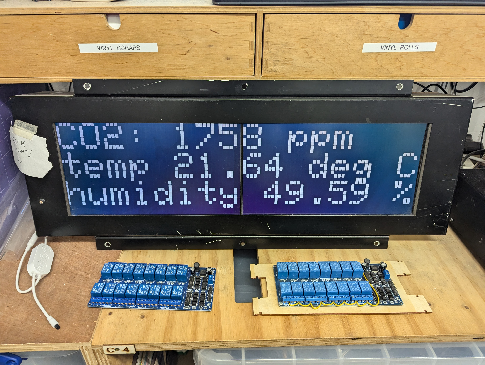
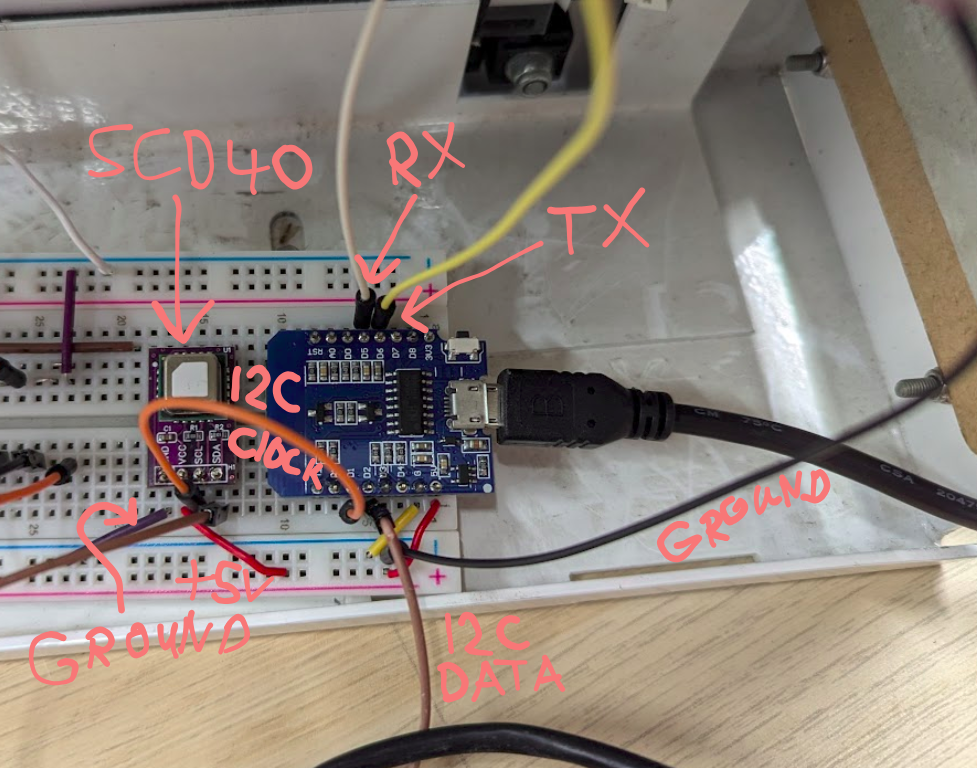

# CO2 train sign

CO2 monitoring, displaying on the train signs.



For more information about the train signs, see <https://github.com/sheffieldhackspace/train-signs>

For more information about the environment monitor, see <https://github.com/alifeee/co2-monitoring>

Note that the sensor is within the sign enclosure, so the measurements are probably not very accurate, as there is likely not much airflow into the enclosure.

## Project layout

This project consists of two folders:

- `./controller/` which is for the Arduino which controls the sign (basically the same as <https://github.com/alifeee/openbenches-train-sign/tree/main/controller>). It listens to Serial on an RX pin, and displays any text it receives (terminated by a null character `"\0"`) on the sign.
- `./monitor/` which is a combination of <https://github.com/alifeee/co2-monitoring> and <https://github.com/alifeee/openbenches-train-sign/tree/main/fetcher>. It talks to the attached CO2 monitor and then sends the results to serial (to the Arduino Uno).

## Development

1. install <https://platformio.org/>
2. `cd` into the relevant folder
3. run the relevant command below (or use the VSCode GUI extension)

### build

```bash
pio run
```

### upload

```bash
pio run -t upload
```

### monitor

```bash
pio device monitor
```

## wiring



